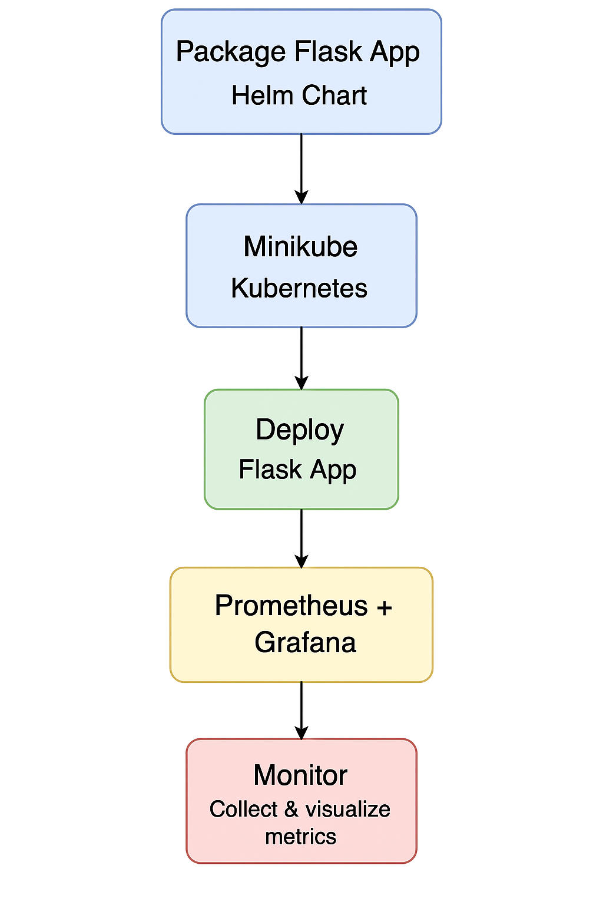

# 🔗 DevOps Project 03: Kubernetes Deployment with Helm Charts + Monitoring

This guide documents the steps followed to create a **DevOps project** focused on deploying a Flask or Nginx application into **Kubernetes** using **Minikube**, along with monitoring setup via **Prometheus + Grafana**. The application was also packaged using **Helm charts** to simplify deployment and configuration.

---

## 🔗 Objectives Completed

* Installed and used **Minikube** and optionally K3d
* Deployed a Flask or Nginx app using Kubernetes YAML and Helm
* Set up monitoring with **Prometheus + Grafana**
* Packaged the app into a reusable **Helm chart**

---

## 🔗 Project Structure Overview

```
devops_project_03_helm/
├── flask-app/
│   ├── app.py
│   ├── Dockerfile
│   └── requirements.txt
├── charts/
│   └── flask-app/
│       ├── Chart.yaml
│       ├── values.yaml
│       └── templates/
│           ├── deployment.yaml
│           ├── service.yaml
├── prometheus-grafana/
│   ├── prometheus.yaml
│   ├── grafana.yaml
├── README.md
```

## 🔗 Project Code Files (Flask App, Helm Chart, Monitoring YAMLs)

### `flask-app/app.py`

```python
from flask import Flask
app = Flask(__name__)

@app.route('/')
def home():
    return "Hello from Flask inside Kubernetes!"

if __name__ == '__main__':
    app.run(host='0.0.0.0', port=5000)
```

---

### `flask-app/Dockerfile`

```Dockerfile
FROM python:3.9-slim

WORKDIR /app
COPY . /app

RUN pip install --no-cache-dir -r requirements.txt

CMD ["python", "app.py"]
```

---

### `flask-app/requirements.txt`

```
flask
```

---

### `charts/flask-app/Chart.yaml`

```yaml
apiVersion: v2
name: flask-app
description: A simple Flask app deployed via Helm
type: application
version: 0.1.0
appVersion: "1.0"
```

---

### `charts/flask-app/values.yaml`

```yaml
replicaCount: 1

image:
  repository: your-dockerhub-username/flask-app
  pullPolicy: IfNotPresent
  tag: latest

service:
  type: NodePort
  port: 5000

resources: {}

nodeSelector: {}
tolerations: []
affinity: {}
```

---

### `charts/flask-app/templates/deployment.yaml`

```yaml
apiVersion: apps/v1
kind: Deployment
metadata:
  name: {{ include "flask-app.fullname" . }}
  labels:
    {{- include "flask-app.labels" . | nindent 4 }}
spec:
  replicas: {{ .Values.replicaCount }}
  selector:
    matchLabels:
      app: flask
  template:
    metadata:
      labels:
        app: flask
    spec:
      containers:
        - name: flask
          image: "{{ .Values.image.repository }}:{{ .Values.image.tag }}"
          ports:
            - containerPort: 5000
```

---

### `charts/flask-app/templates/service.yaml`

```yaml
apiVersion: v1
kind: Service
metadata:
  name: flask-service
spec:
  type: {{ .Values.service.type }}
  selector:
    app: flask
  ports:
    - protocol: TCP
      port: {{ .Values.service.port }}
      targetPort: 5000
```

---

### `prometheus-grafana/prometheus-values.yaml`

```yaml
alertmanager:
  enabled: false

pushgateway:
  enabled: false

server:
  service:
    type: NodePort
    nodePort: 30090
```

---

### `prometheus-grafana/grafana-values.yaml`

```yaml
adminPassword: admin
service:
  type: NodePort
  nodePort: 30030
```


## 🔗 Deployment Architecture Followed

<p align="center">
  
</p>

---

## 🔗 System Prerequisites

* Ubuntu 20.04 or later
* Docker, kubectl, and Helm installed

### 🔗 Commands to Verify Setup

Check if Minikube is installed:

```bash
which minikube
```

If not present, Minikube was installed using:

```bash
curl -LO https://storage.googleapis.com/minikube/releases/latest/minikube-linux-amd64
sudo install minikube-linux-amd64 /usr/local/bin/minikube
rm minikube-linux-amd64
```

Verify:

```bash
minikube version
```

Install kubectl (if not already available):

```bash
sudo apt update
sudo apt install -y apt-transport-https ca-certificates curl
curl -fsSL https://packages.cloud.google.com/apt/doc/apt-key.gpg | sudo apt-key add -
echo "deb https://apt.kubernetes.io/ kubernetes-xenial main" | sudo tee /etc/apt/sources.list.d/kubernetes.list
sudo apt update
sudo apt install -y kubectl
```

### 🔗 Check Cluster Status and Drivers

The following commands helped verify the current state and configuration of Minikube:

```bash
minikube status        # displays the status of the Minikube cluster (running, paused, stopped)
minikube profile list  # lists all Minikube profiles available on the machine
```
**minikube drivers** shows where Minikube can run the Kubernetes cluster whether inside Docker, a VM, or bare metal, depending on the installed and compatible drivers.
> `minikube drivers` was previously used in older versions to list supported container drivers, but the command has since been deprecated or removed in the latest versions. Refer to the Minikube documentation for updated ways to check available drivers.

### 🔗 Confirm Tool Versions

These commands were used to verify that the installed versions of tools are available and functioning as expected:

```bash
minikube version          # shows the version of Minikube installed
helm version              # displays Helm version and client details
kubectl version --client  # outputs the client version of kubectl installed
```
## 🔗 Common kubectl Commands Used

* `kubectl get nodes` — Displays active nodes
* `kubectl get pods` — Lists all running pods
* `kubectl get services` — Displays service mappings
* `kubectl describe pod <pod-name>` — Shows pod details
* `kubectl logs <pod-name>` — Retrieves container logs
* `kubectl apply -f file.yaml` — Applies Kubernetes configuration
* `kubectl delete -f file.yaml` — Removes resources defined in YAML
---

## 🔗 Step 1: Start Minikube (Kubernetes Cluster Creation)

```bash
minikube start --driver=docker
```
This command initializes the Kubernetes control plane and provisions a single-node cluster using Docker as the driver.

> This command can be run from any directory ( home or project folder). However, running it inside the project directory can help keep context and workflows organized.

Optionally, ingress addon was enabled:

```bash
minikube addons enable ingress
```
This command enables the NGINX Ingress Controller inside the Minikube cluster.

##### 🔗 Why it's important:

Allows exposing multiple Kubernetes services under a single external IP or domain.

Enables clean routing rules via URLs (/api, /dashboard).

Supports TLS termination for HTTPS routes.

Essential when managing access to services like Prometheus, Grafana or Flask apps from outside the cluster.

---

### 🔗 Helm Installation Steps (Snap Method)

When trying to install Helm using Snap, the following message appeared:

```bash
sudo snap install helm

```

To proceed, Helm was successfully installed using:

```bash
sudo snap install helm --classic
```

Output:

```
helm 3.18.3 from Snapcrafters✪ installed
```

Verification:

```bash
helm version
```
---

### 🔗What are `helm create` and `helm install`

#### 🔗 `helm create <chart-name>` 

This command **generates a boilerplate Helm chart directory structure** with default files and templates. It is used to scaffold a new chart that can later be customized and deployed.

**Example:**

```bash
helm create charts/flask-app
```

This creates a directory structure like:

```
charts/flask-app/
├── Chart.yaml
├── values.yaml
└── templates/
    ├── deployment.yaml
    ├── service.yaml
    └── _helpers.tpl
```

The files can then be modified (Docker image name, ports, replicas) to fit the application.

#### 🔗 `helm install <release-name> <chart-path>` 

This command **installs (deploys) a Helm chart** to a Kubernetes cluster.

**Example:**

```bash
helm install flask charts/flask-app
```

This installs the `flask-app` Helm chart from the given path with the release name `flask` into the current Kubernetes context.

**Key difference:**

* `helm create` is for chart creation (scaffolding templates).
* `helm install` is for deploying a chart to a live cluster.

Together, these commands form the build → deploy cycle using Helm.

## 🔗 Step 2: Helm Chart Packaging for Flask App

A Helm chart was created for the app:

```bash
helm create charts/flask-app
```

The default templates (`deployment.yaml`, `service.yaml`) were customized to suit the Flask application.

The `values.yaml` file was modified with actual Docker Hub repository info:

```yaml
image:
  repository: <dockerhub-username>/flask-app
  tag: latest
  pullPolicy: IfNotPresent

service:
  type: NodePort
  port: 5000
```

---

## 🔗 Step 3: Build & Deploy Flask App with Helm

Docker image was built and pushed:

```bash
cd flask-app
docker build -t <dockerhub-username>/flask-app .
docker push <dockerhub-username>/flask-app
```

Helm was used to deploy the application:

```bash
helm install flask charts/flask-app
```

To confirm deployment:

```bash
kubectl get all
```

To apply changes:

```bash
helm upgrade flask charts/flask-app
```

To remove the deployment:

```bash
helm uninstall flask
```

---

## 🔗 Step 4: Monitoring with Prometheus + Grafana

Helm repos were added:

```bash
helm repo add prometheus-community https://prometheus-community.github.io/helm-charts
helm repo add grafana https://grafana.github.io/helm-charts
helm repo update
```

Prometheus and Grafana were installed:

```bash
helm install prometheus prometheus-community/prometheus
helm install grafana grafana/grafana --set adminPassword='admin' --set service.type=NodePort
```

## 🔗 Updated Monitoring Setup with Custom Values

To enable customization and maintainability, default values were extracted into custom Helm values files:

Prometheus:
- File created: `prometheus-grafana/prometheus-values.yaml`

```yaml
alertmanager:
  enabled: false

pushgateway:
  enabled: false

server:
  service:
    type: NodePort
    nodePort: 30090
```

Grafana:
- File created: `prometheus-grafana/grafana-values.yaml`

```yaml
adminPassword: admin

service:
  type: NodePort
  nodePort: 30030
```

These custom files were used with Helm upgrade:

```bash
helm upgrade --install prometheus prometheus-community/prometheus -f prometheus-grafana/prometheus-values.yaml
helm upgrade --install grafana grafana/grafana -f prometheus-grafana/grafana-values.yaml
```

Old Kubernetes YAMLs (`prometheus.yaml`, `grafana.yaml`) were removed to avoid duplication and confusion.

---

## 🔗 Verifying with kubectl

After deployment, verification was done using `kubectl`:

```bash
kubectl get pods       # List all pods and their status
kubectl get services   # Check service exposure, especially NodePorts
kubectl get all        # View deployments, replicasets, services and pods together
```

To retrieve Grafana credentials:

```bash
kubectl get secret --namespace default grafana -o jsonpath="{.data.admin-password}" | base64 --decode ; echo
```

To access Grafana UI:

```bash
minikube service grafana
```

Inside Grafana:
- Prometheus was added as a data source to enable dashboard creation.

## 🔗 Step 5: Importing Community Dashboards in Grafana

To import popular and ready-made dashboards into Grafana:

1. **Go to the Grafana UI**
   - Open in browser using:
     ```bash
     minikube service grafana
     ```

2. **Login** using the credentials:
   - **Username**: `admin`
   - **Password**: `admin` *(or the one user configured)*

3. **From the left sidebar**, click on **+ (Create)** → **Import**.

4. **Enter Dashboard ID**
   - For example, used one of the following:
     - `1860` — Kubernetes Cluster Monitoring
     - `3662` — Node Exporter Full

5. **Click "Load"**.

6. **Set Prometheus as the data source** from the dropdown.
   - If not already configured, set:
     - **URL**: `http://prometheus-server.default.svc.cluster.local`

7. **Click "Import"**.

Now should now see beautiful dashboards visualizing metrics from user's Kubernetes pods, nodes, services and more.

---

## 🔗 Outcome

The following milestones were completed:

* A Kubernetes cluster was set up locally using Minikube
* A Flask app was containerized and packaged using Helm
* The app was deployed on Kubernetes via Helm
* Monitoring was added through Prometheus and Grafana

# Debugging and More Helpful Commands and Discussions:
### 🔗 Resolving Helm Chart Installation Error

The following error was encountered when attempting to install the Flask Helm chart:

```bash
Error: INSTALLATION FAILED: template: flask-app/templates/serviceaccount.yaml:1:14: executing "flask-app/templates/serviceaccount.yaml" at <.Values.serviceAccount.create>: nil pointer evaluating interface {}.create
```

#### 🔹 Root Cause

This error indicates that the default `serviceaccount.yaml` generated by `helm create` is referencing `.Values.serviceAccount.create`, which does not exist in the `values.yaml` file unless defined explicitly. This issue often occurs when default files generated by `helm create` are not cleaned or customized.

#### 🔗 Recommended Fix

To resolve this:

1. **Delete the default `serviceaccount.yaml` template** (if not needed):

   ```bash
   rm charts/flask-app/templates/serviceaccount.yaml
   ```

   Most simple applications do not need a custom Kubernetes ServiceAccount, so this file can safely be removed.

2. **OR define `serviceAccount` values** in `values.yaml`:

   ```yaml
   serviceAccount:
     create: false
     name: ""
   ```

   This suppresses the service account creation logic.

#### 🔗 Additional Cleanup

When using `helm create`, it’s also safe to remove other unnecessary files unless explicitly used:

```bash
rm charts/flask-app/templates/tests/test-connection.yaml
rm charts/flask-app/templates/ingress.yaml
```

> Keeping the chart minimal avoids unexpected errors and makes it easier to manage.

---

After cleanup, re-run:

```bash
helm install flask charts/flask-app
```

And verify with:

```bash
kubectl get all
```

If needed:

```bash
helm uninstall flask
```

### 🔗 Interpreting `kubectl get all` Output for Flask App

When running:

```bash
kubectl get all
```

Output:

```bash
NAME                                  READY   STATUS              RESTARTS   AGE
pod/flask-flask-app-8d8cd4757-5plpq   0/1     ContainerCreating   0          43s

NAME                    TYPE        CLUSTER-IP       EXTERNAL-IP   PORT(S)          AGE
service/flask-service   NodePort    10.107.211.136   <none>        5000:31191/TCP   43s
service/kubernetes      ClusterIP   10.96.0.1        <none>        443/TCP          106m

NAME                              READY   UP-TO-DATE   AVAILABLE   AGE
deployment.apps/flask-flask-app   0/1     1            0           43s

NAME                                        DESIRED   CURRENT   READY   AGE
replicaset.apps/flask-flask-app-8d8cd4757   1         1         0       43s
```

#### 🔗 Interpretation:

* **Pod Status:**

  * The pod is in `ContainerCreating` state, which means Kubernetes is still pulling the Docker image or initializing the container.
  * This is expected behavior if the image is large, slow to pull, or not yet available publicly.

* **Deployment and ReplicaSet:**

  * 1 replica is desired and 1 is created, but it's not yet `READY`. This aligns with the pod still being in the initialization phase.

* **Service:**

  * `flask-service` is successfully created as a `NodePort` service and is exposing port 5000 on internal port `31191`.

#### 🔗 Next Steps:

* Run the following to watch pod status:

  ```bash
  kubectl get pods -w
  ```

  Wait until status changes from `ContainerCreating` to `Running`.

* If the pod remains stuck:

  ```bash
  kubectl describe pod <pod-name>
  kubectl logs <pod-name>
  ```

  Replace `<pod-name>` with the actual pod name like:

  ```bash
  kubectl describe pod flask-flask-app-8d8cd4757-5plpq
  ```

These commands will reveal whether the image was pulled successfully or if there were errors ( authentication, image not found, or DockerHub access issues).

## 🔗 Another Option for Step 4 : Apply Raw YAMLs Using kubectl

If Helm is not preferred or unavailable, Prometheus and Grafana can also be deployed using plain Kubernetes YAML manifests.

This is a manual approach, best used for basic testing or where Helm isn’t suitable.

Ensure the files under `prometheus-grafana/` ( `prometheus.yaml` and `grafana.yaml`) are valid Kubernetes manifests containing fields like `apiVersion`, `kind`, `metadata`, `spec`, etc.

Apply them using the following commands:

```bash
kubectl apply -f prometheus-grafana/prometheus.yaml
kubectl apply -f prometheus-grafana/grafana.yaml
```

### 🔗 Notes:
- This approach does not support Helm’s versioning, values overrides, or rollbacks.
- Recommended only for quick tests or custom hand-crafted YAMLs.
- Make sure ports and service types are properly configured (e.g., `NodePort`, `ClusterIP`).

> For better reusability and lifecycle management, the Helm-based installation remains the recommended approach.

## 🔗 Grafana Access Credentials

When deploying Grafana via Helm, the default admin username is typically `admin`. The password can be set manually using the `--set adminPassword='...'` flag or via a `values.yaml` file.

In this setup, both username and password were set to:

* **Username**: `admin`
* **Password**: `admin`

This is fine for local development and testing, especially when accessing through:

```bash
minikube service grafana
```

🔗 **Note**: For production deployments, always use a strong password and secure access with authentication, TLS, and proper role-based access controls.

---

## 🔗 Grafana Dashboards (Manual and Automated Import)

### 🔗 Option 1: Manual Import from Grafana Dashboard IDs

1. Launch Grafana in the browser:

   ```bash
   minikube service grafana
   ```
2. Login with the default credentials:

   * Username: `admin`
   * Password: `admin`
3. From the left menu, click **+ → Import**
4. Enter a Dashboard ID and click **Load**:

| Dashboard ID | Description                                             |
| ------------ | ------------------------------------------------------- |
| `11074`      | Flask App metrics via `prometheus_flask_exporter`       |
| `1860`       | Kubernetes cluster metrics (Prometheus + Node Exporter) |
| `3662`       | Full Node Exporter system metrics                       |

5. Choose **Prometheus** as the data source → Click **Import**

---

### 🔗 Option 2: Automatically Provision Dashboards via Kubernetes

This approach provisions dashboards on Grafana startup via Helm + ConfigMaps.

#### 🔗 Step 1: Download the JSON Dashboard

Create a folder:

```bash
mkdir -p prometheus-grafana/dashboards
```

Download dashboard JSON:

```bash
wget https://grafana.com/api/dashboards/11074/revisions/1/download -O prometheus-grafana/dashboards/flask_dashboard.json
```

---

#### 🔗 Step 2: Create a ConfigMap for the Dashboard

Create `prometheus-grafana/grafana-dashboard-config.yaml`:

```yaml
apiVersion: v1
kind: ConfigMap
metadata:
  name: grafana-dashboards
  labels:
    grafana_dashboard: "1"
data:
  flask_dashboard.json: |
    { Paste the raw contents of flask_dashboard.json here }
```

---

#### 🔗 Step 3: Update grafana-values.yaml to Load Dashboard

Update or create `grafana-values.yaml`:

```yaml
adminPassword: admin

service:
  type: NodePort
  nodePort: 30030

sidecar:
  dashboards:
    enabled: true
    label: grafana_dashboard
    labelValue: "1"
    folder: /var/lib/grafana/dashboards

dashboardsConfigMaps:
  default: grafana-dashboards
```

---

#### 🔗 Step 4: Apply Changes Using Helm Upgrade

```bash
helm upgrade grafana grafana/grafana -f prometheus-grafana/grafana-values.yaml
```

---

## 🔗 Optional: Raw Kubernetes YAMLs via kubectl (No Helm)

If using `prometheus.yaml` and `grafana.yaml` files manually instead of Helm charts, apply them like so:

```bash
kubectl apply -f prometheus-grafana/prometheus.yaml
kubectl apply -f prometheus-grafana/grafana.yaml
```

This is valid when files contain raw Kubernetes manifests ( `apiVersion`, `kind`, `metadata`).

Helm remains the preferred method for production or repeatable setups.


---

